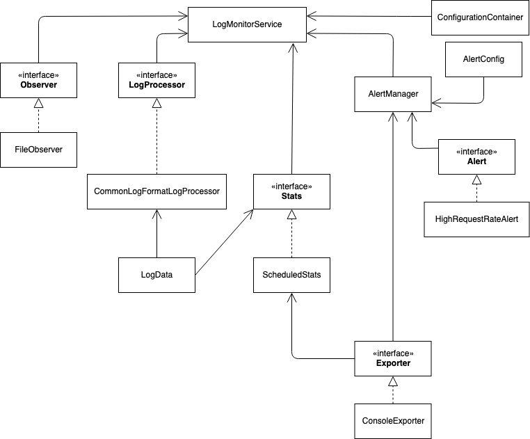
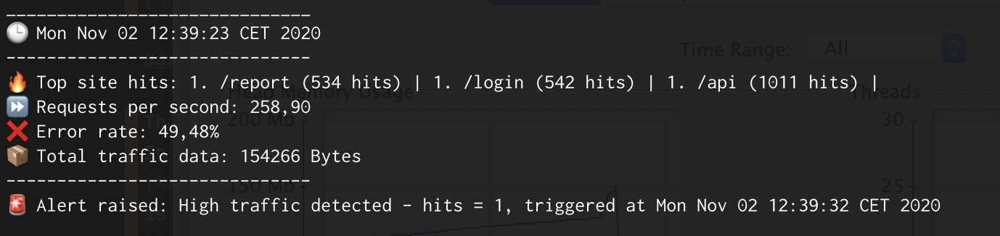
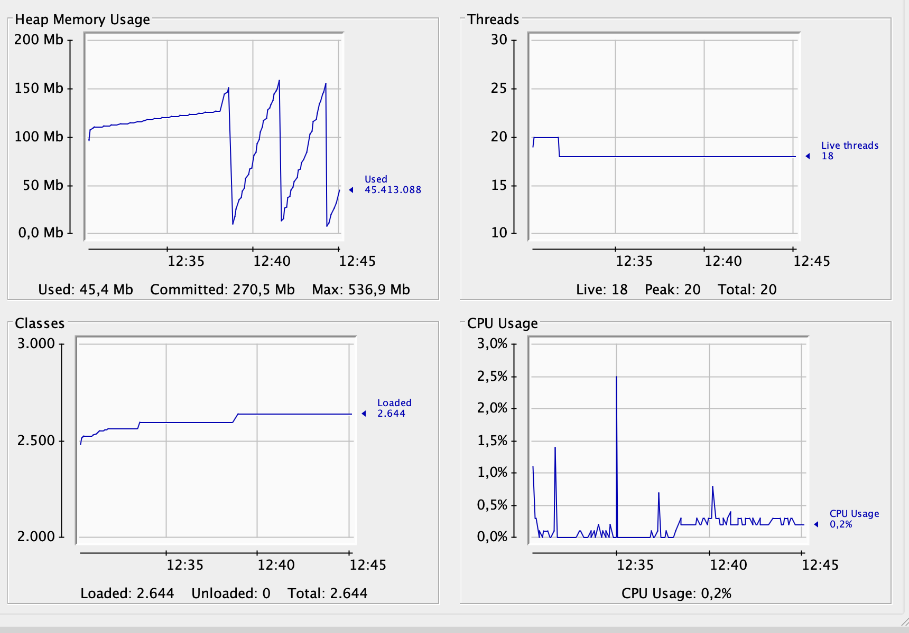
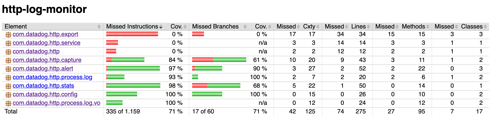

# HTTP Log Monitor

This application is a standalone Java executable that continuously observes updates in an HTTP server log file written
in [Common Log Format](https://en.wikipedia.org/wiki/Common_Log_Format) and publishes statistics and alerts
periodically.

## Design

The ideas behind the proposed architecture are fundamentally two: Extendability and performance.
The following diagram shows how the components of the architecture interact with each other, organized from
left to right in terms of their duty in the whole process.



*NOTE: The entrypoint, the [App](src/main/java/com/adambarreiro/monitor/App.java) class, is omitted as its duty is only
to create and inject all dependencies.*

The usage of frameworks is also minimal, and this is intented.

### Extension

The basic requisites were the following:

- Display stats every 10s: Top sites, relevant stats.
- Run continuously.
- Alerting system running every 2min.
- Alerts on high request rate > 10.0 req/s.
- Resolution of alerts.
- Tests

The implemented components are meeting these requirements, but also the whole design is prepared to onboard new ones
if required. The key ingredient is the usage of SOLID principles, this way the different pieces have **a specific 
responsibility and role** in the process, interfaces are small and **segregated** and the components **depend on
abstractions**, not concrete implementations.

#### Interface segregation and responsibilities

The architecture has the following interfaces:

- **[Observer](src/main/java/com/adambarreiro/monitor/capture/Observer.java)**

Allows to observe a source and stream its
contents to any destination. A 
[consumer function](https://github.com/ReactiveX/RxJava/blob/3.x/src/main/java/io/reactivex/rxjava3/functions/Consumer.java)
specifies this destination (and behavior).

In the proposed solution, there's a [FileObserver](src/main/java/com/adambarreiro/monitor/capture/FileObserver.java) implementing 
this interface, that monitors and streams a text file to another component.

If we want to extend the capabilities of the application, we could create other implementations. To illustrate this
capability, a dummy [HttpObserver](src/main/java/com/adambarreiro/monitor/capture/HttpObserver.java) class has been
provided.

- **[LogProcessor](src/main/java/com/adambarreiro/monitor/process/log/LogProcessor.java)**

The requirement was to parse logs in [Common Log Format](https://en.wikipedia.org/wiki/Common_Log_Format), but what if
some user needs its own format, like JSON? With this interface, we can implement any formatting processing we want. The
main idea is that any log format must be translated to the [LogData](src/main/java/com/adambarreiro/monitor/process/log/vo/LogData.java)
value object, so the rest of the architecture only needs to understand this unique structure. This way we decouple the log format
from the processing of statistics.

- **[Stats](src/main/java/com/adambarreiro/monitor/stats/Stats.java)**

We have a [ScheduledStats](src/main/java/com/adambarreiro/monitor/stats/ScheduledStats.java) component implementing this
interface, that publishes stats in a scheduled way, but this interface allows to create any other mechanism to show the
stats.

At first this may look not necessary but this feature comes handy when thinking about testing. As the AlertManager needs
an Stats component to work, we can create a [DummyStats](src/test/java/com/adambarreiro/monitor/http/stats/DummyStats.java) class to
provide a mock and give any stat we need to test the alerting system.

- **[Exporter](src/main/java/com/adambarreiro/monitor/export/Exporter.java)**

The requirement was to publish the information to stdout, but normally we want to have these stats exported to different
endpoints such as HTTP, JMX or a messaging queue; even with different formats like JSON, XML...

In the solution we have the [ConsoleExporter](src/main/java/com/adambarreiro/monitor/export/ConsoleExporter.java) but there are
other dummy exporters such as [HttpExporter](src/main/java/com/adambarreiro/monitor/export/HttpExporter.java) and
[JMXExporter](src/main/java/com/adambarreiro/monitor/export/JMXExporter.java) to illustrate this capability.

### Performance

This app has to do a lot of things and run continuously, hence it was a perfect candidate to use a multithreaded approach.
In the **[FileObserver](src/main/java/com/adambarreiro/monitor/capture/FileObserver.java)** implementation I used
[RxJava](https://github.com/ReactiveX/RxJava) to have a reactive approach (hence the name "observer"). The overall idea
is that the component processing the log file "subscribes" to the file updates and forgets about polling loops.

The other two main components spawning threads are the
[ScheduledStats](src/main/java/com/adambarreiro/monitor/stats/ScheduledStats.java) and
[AlertManager](src/main/java/com/adambarreiro/monitor/alert/AlertManager.java), the main reason is that they needed to be scheduled,
so this way they can run perfectly asynchronous.

To test the application and its performance, a script called [simulateLogging.sh](scripts/simulateLogging.sh) is provided.
It's a very simple script that generates CLF log entries in a given file continuously. Then, you can run `jconsole` to watch
how the executable behaves.

Here is a quick overview of the script creating requests at maximum rate allowed by my MacBook (I set `sleep 0` in that script
to simulate a flood).

With this tweak, the script was creating **260-290** req/s approximately in a log file:



*This could be a bot attack in our API!* 🙂

The JMX stats:



I ran the app using the `make run` command explained below, that limits the heap to 512 MB. The memory consumption
increases rapidly due to the flood of log entries, but is easily garbage collected.

## Testing

Tests for the most critical classes have been provided. Right now there is a **coverage of 71%**:



The missing % is essentially due to:

- Lack of testing in the [ConsoleExporter](src/main/java/com/adambarreiro/monitor/export/ConsoleExporter.java) class.
I didn't see any value in testing a class that essentially does `System.out.println()`.
- Lack of testing in the [LogMonitorService](src/main/java/com/adambarreiro/monitor/service/LogMonitorService.java) class.
Same as above, this class is just orchestrating components that are extensively tested.

The hardest part was testing the async components, AlertManager and ScheduledStats. This was mitigated using a feature
of JUnit 5 called **preemptive timeouts**. This way we can start the async component and wait for the result for a given
period of time, if the timeout happens the test will fail. My concern here is that these specific tests are a bit coupled
to the performance of the machine in which they run, but the timeout is considerably high.

## Usage

To build the project you can execute the following command. You only need to have `openJDK 14` and `make` installed:

```shell script
make build
```

This will compile, test and package the application. To check the coverage report:

```shell script
make coverage-report
``` 

To simulate log requests, the script `simulateLogging.sh` is provided. You can tweak its behaviour as follows:

```
4: declare logPath="<path of the log file>"
27: sleep <seconds between requests>;
```

To execute the application with the **default settings** you can execute the following command:

```shell script
make run
```

The application admits some configuration parameters:

| Option              | Defaults to      | Description
|---------------------|------------------|-----------
|alertInterval        | 120              | Period in seconds of every alert check
|logFile              | /tmp/access.log  | Location of the log file to monitor
|requestRateThreshold | 10.0             | A higher request rate than the specified will trigger alerts.
|scheduleInterval     | 10               | Period in seconds of every statistics update.

You can override the defaults with the following:

```shell script
make args="-logFile /Users/adam/Desktop/access.log -alertInterval 60 -scheduleInterval 5" run
```

## Improvements

- **Lack of logging**: We could put a logging framework like [log4j2](https://logging.apache.org/log4j/2.x/) so
we can get rid of the `System.out.println` statements, as we could write to stdout, to a file, etc.

- **Better exception handling**: An extension of the above improvement. Right now the stack traces are directly
written to stderr with `e.printStackTrace()`.

- **AlertManager** should have an interface in the future, for the same reason **ScheduledStats** has one.
It was not provided because right now no component tests need this one.

- **Configuration**: Right now the app supports configuration via command args. Another option could be environment
variables and properties files, much like Spring Boot apps.

- **Common Log Format**: The CLF regex pattern is a bit weak, it could be improved.

- **Dependency management**: A dependency injection container would be nice, right now DI is being done instantiating
everything in the App class. If not possible, we could also create some factories or strategies to enabling the
capability of choosing which dependencies to use.

- **Alert scalability**: Right now the alert threshold checking is being done through hardcoded conditionals in the
AlertManager component and this is not very scalable. The solution would be to create a mechanism similar to filters.
This way we could inject a set of filters to the AlertManager and it would simply execute them in order. This decouples
completely the alert definition from the execution.

- **Backpressure**: The streaming of the log file rely on the backpressure internals of RxJava, we could have a simple
mechanism to impede the observer from sending log entries indiscriminately to the consumer to avoid memory usage with heavy
request loads.
 
- **Dockerize the application** and **Continuous integration**.
